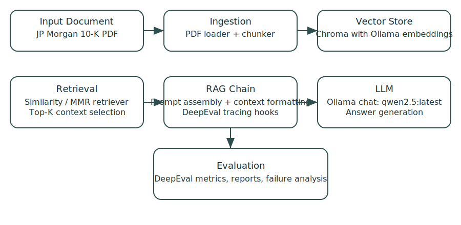
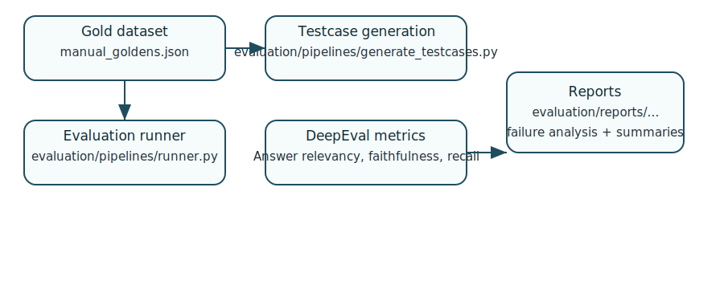
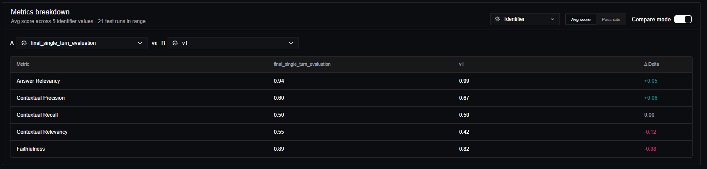

# Chase-bot Evaluation Suite

> Confident AI / DeepEval evaluation for a finance RAG pipeline built around the JPMorgan 10-K.



## Overview

This repository is evaluation-first, not a demo chatbot.
It is built to measure how document retrieval, chunking, and prompt grounding affect answer quality over a scanned financial filing.

Key goals:

- quantify retrieval behavior on PDF content
- compare chunking and retriever strategies
- track `deepeval` metrics for relevance, faithfulness, precision, and recall
- create reusable evaluation artifacts, reports, and analysis notes

> The Streamlit app is available for manual inspection, but the core value lies in the evaluation pipelines and reports.

## Visual summary



## What is included

- `evaluation/pipelines/runner.py` — final single-turn evaluation runner
- `evaluation/human_eval/run_single_eval.py` — manual evaluation query runner
- `evaluation/pipelines/generate_testcases.py` — DeepEval testcase generation
- `evaluation/configs/final.yaml` — experiment configuration (similarity retrieval, k=6, chunk size 800, overlap 600)
- `evaluation/reports/` — experiment summaries, failed case analysis, and tracing observations
- `app/retrievers/` — Chroma vector store, similarity/MMR retrievers, Ollama embeddings
- `app/chains/rag_chain.py` — RAG chain construction and prompt context formatting
- `app/ingestion/` — PDF loader, document cleaner, splitter, chunk builder
- `app/llms/` — Ollama chat integration for evaluation responses

## Setup

### Python

- Recommended: Python 3.11 or newer

### Dependencies

Install from the included `requirements.txt`:

```bash
pip install -r requirements.txt
```

The project also supports manual install:

```bash
pip install streamlit pyyaml python-dotenv langchain_ollama langchain_chroma langchain_community deepeval
```

### `.env` configuration

This project requires a Confident AI API key for `deepeval` login. It also uses OpenAI tracing, so add an OpenAI key and enable trace flushing:

Copy `.env.example` to `.env` in the repository root and fill in the values with your own secrets:

```bash
cp .env.example .env
```

```ini
CONFIDENT_API_KEY=your_confident_api_key_here
OPENAI_API_KEY=your_openai_api_key_here
CONFIDENT_TRACE_FLUSH=1
```

Then confirm login with:

```bash
python -c "from evaluation.datasets.deepeval_login import run_login; run_login()"
```

> Note: `evaluation/pipelines/generate_testcases.py` and `evaluation/datasets/manual_dataset.py` also call `run_login()` automatically.

## Run the evaluation

### 1. Prepare the vector store

The retriever builds a Chroma index from `data/raw_docs/JPmorgan10kReport.pdf` automatically if no persisted store exists.

### 2. Run the final evaluation

```bash
python evaluation/pipelines/runner.py
```

This executes the final experiment defined in `evaluation/configs/final.yaml` and writes metrics to the `deepeval` workflow.

### 3. Run human-style evaluation

```bash
python evaluation/human_eval/run_single_eval.py
```

This evaluates manually curated queries from `data/evaluation/manual_goldens.json`, capturing retrieved chunks and generated answers.

### 4. Generate DeepEval testcases

```bash
python evaluation/pipelines/generate_testcases.py
```

This creates evaluation testcases from the current retriever and dataset configuration.

## Evaluation highlights



### Final evaluation (`final_v1`)

- Answer Relevancy: 0.94
- Faithfulness: 0.89
- Contextual Precision: 0.60
- Contextual Recall: 0.50
- Contextual Relevancy: 0.55

Key finding: retrieval tuning improved grounding quality and faithfulness, while recall remained challenged by OCR/document noise.

### Retrieval experiments

- `topk_exp` (`v3`): increased `top_k` from 4 → 6 and improved recall (0.53 → 0.57) and relevancy (0.47 → 0.53) without sacrificing precision.
- `mmr_exp` (`v4`): MMR retrieval reduced duplicate context but hurt recall and relevancy for this scanned-document pipeline.

## Project structure

```text
.
├── app/
│   ├── chains/
│   ├── ingestion/
│   ├── llms/
│   ├── memory/
│   ├── prompts/
│   └── retrievers/
├── data/
│   ├── evaluation/
│   ├── raw_docs/
│   └── vectorstores/
├── evaluation/
│   ├── configs/
│   ├── datasets/
│   ├── human_eval/
│   ├── pipelines/
│   └── reports/
├── assets/
│   ├── architecture.svg
│   ├── evaluation_flow.svg
│   └── streamlit_screenshot.svg
├── streamlit_app.py
├── requirements.txt
└── README.md
```

## Notes

- Source PDF: `data/raw_docs/JPmorgan10kReport.pdf`
- Persisted vector store: `data/vectorstores/chroma_langchain_db/`
- Chat model: `qwen2.5:latest`
- Embeddings: `nomic-embed-text`
- Core goal: evaluation quality, not conversational UX

## Optional local browser tool

If you want manual inspection:

```bash
streamlit run streamlit_app.py
```
