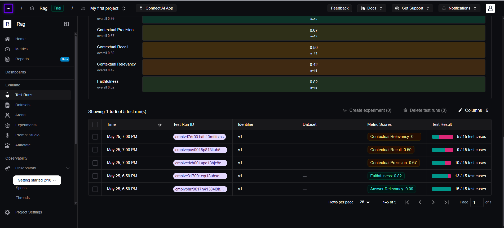
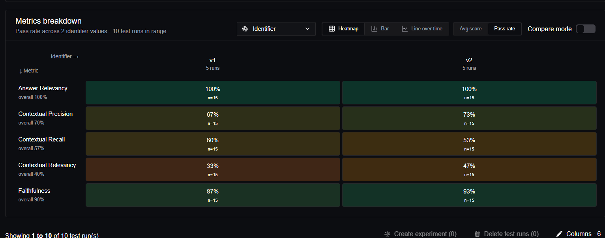

V1 Evaluation Results:

Answer Relevancy: 0.99
Faithfulness: 0.82
Contextual Precision: 0.67
Contextual Recall: 0.50
Contextual Relevancy: 0.42

Key Insight:
The chatbot generates relevant and mostly grounded responses, but retrieval quality is weak. The primary bottleneck appears to be retrieval recall and contextual relevancy rather than generation capability.

Likely Causes:

OCR noise from scanned PDFs
fragmented chunking
retrieval of semantically noisy chunks
insufficient overlap between chunks

Planned Improvements
Reduce chunk size
Increase chunk overlap
Improve OCR preprocessing
Experiment with top_k retrieval
Add retrieval reranking
------------------------------------------------------------------------------------------------------

V2 Evaluation Results:

Metric	v1	v2
Answer Relevancy	0.99	0.99
Faithfulness	0.82	0.93
Contextual Precision	0.67	0.73
Contextual Recall	0.60	0.53
Contextual Relevancy	0.33	0.47

Key Insights:
The updated chunking strategy improved retrieval precision, contextual relevancy, and grounding quality. Responses became more faithful and retrieval results became semantically cleaner.

However, contextual recall slightly decreased, indicating a retrieval tradeoff between precision and broader context coverage.

Observed Improvements:

Higher faithfulness suggests stronger grounding in retrieved context
Improved contextual precision indicates better retrieval ranking quality
Increased contextual relevancy suggests reduction in noisy retrieved chunks
Generation quality remained consistently strong

Tradeoff Observed:
Reducing chunk size improved retrieval focus and semantic coherence, but slightly reduced contextual recall, likely because broader information became distributed across more chunks.

Technical Interpretation:
The evaluation results suggest that retrieval quality is highly sensitive to chunking configuration, especially for scanned PDF pipelines where OCR noise and fragmented document structure affect embedding quality.