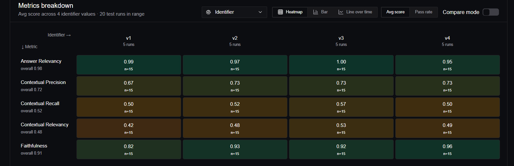
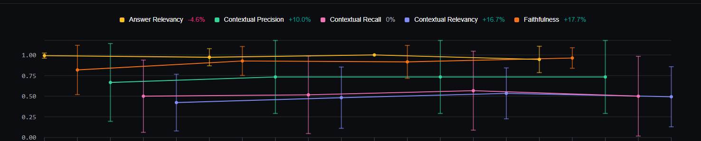

# Retrieval Experiment Summary — v4 (MMR)

Experiment:
Evaluated MMR (Max Marginal Relevance) retrieval to improve retrieval diversity and reduce duplicate chunks.

Results:
- Faithfulness improved slightly
- Contextual recall decreased
- Contextual relevancy decreased
- Answer relevancy slightly decreased

Key Insight:
For this scanned-document RAG pipeline, diversity-aware retrieval reduced retrieval completeness and removed some useful contextual overlap. Standard similarity retrieval with improved chunking and higher top_k performed better overall.

Conclusion:
MMR retrieval was not beneficial for the current dataset and retrieval characteristics.